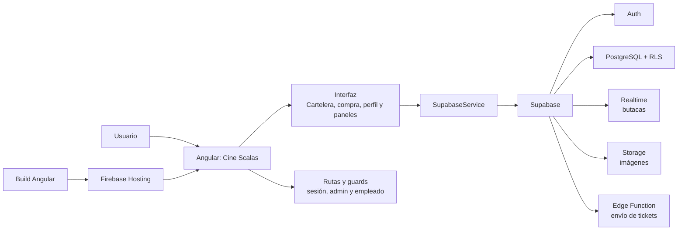
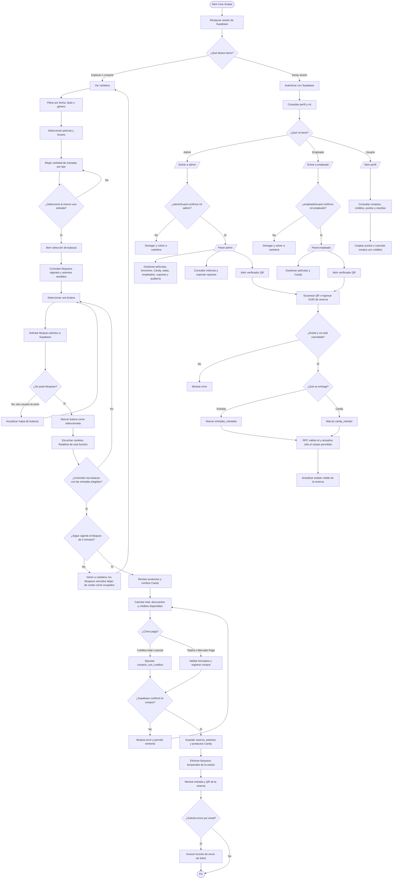

# Cine Scalas

Aplicación web desarrollada como trabajo práctico de la asignatura **Programación IV**, correspondiente a la **Tecnicatura Universitaria en Programación** de la **Universidad Tecnológica Nacional, Facultad Regional Avellaneda**.

El proyecto modela el flujo de una plataforma de cine: consulta de cartelera y funciones, selección de entradas y butacas, compra de productos de Candy Bar y administración de las operaciones del establecimiento. Su propósito es académico y permite aplicar contenidos de desarrollo frontend, persistencia, autenticación, autorización e integración con servicios externos.

## Funcionalidades

- Consulta de películas, géneros, sinopsis, calificaciones y horarios disponibles.
- Selección de entradas por categoría y elección de butacas.
- Compra de productos y combos de Candy Bar junto con las entradas.
- Inicio de sesión, registro y perfil con historial de compras, créditos y puntos.
- Gestión de datos del perfil con confirmación de contraseña y cambio de contraseña.
- Emisión y validación de entradas mediante códigos QR; descarga del ticket en PDF.
- Panel de administración para gestionar películas, funciones, productos, combos, cupones y descuentos.
- Registro de auditoría con fecha, hora, usuario y tipo de operación para cambios y transacciones relevantes.
- Métricas de facturación, entradas vendidas y rankings, con exportación de reportes a PDF y Excel.
- Interfaz instalable como aplicación web progresiva (PWA).

## Tecnologías

- **Angular 22** para la aplicación cliente, con componentes independientes, rutas, formularios reactivos y signals.
- **TypeScript 6** para la lógica y el tipado estático.
- **SCSS** para los estilos de la interfaz.
- **Supabase** para autenticación, base de datos PostgreSQL y funciones RPC.
- **ZXing** y `angularx-qrcode` para lectura y generación de códigos QR.
- **jsPDF** para la generación de tickets e informes PDF.
- **SheetJS (`xlsx`)** para exportar informes en formato Excel `.xlsx`.
- **Firebase Hosting** como destino de publicación configurado.

## Arquitectura



## Requisitos

- Node.js compatible con Angular 22.
- npm. La versión declarada por el proyecto es `11.12.1`.
- Una instancia de Supabase configurada para la aplicación.

## Instalación

1. Clonar el repositorio y entrar en el directorio del proyecto:

   ```bash
   git clone <URL-del-repositorio>
   cd app-cine
   ```

2. Instalar las dependencias:

   ```bash
   npm install
   ```

3. Configurar la URL y la clave pública de Supabase en:

   - `src/environments/environment.development.ts` para desarrollo.
   - `src/environments/environment.ts` para la compilación de producción.

   La configuración utiliza las propiedades `supabaseUrl` y `supabaseKey`. Cada archivo debe contener las credenciales correspondientes al proyecto de Supabase que se utilizará.

4. Para una instancia nueva, abrir el **SQL Editor** de Supabase y ejecutar el contenido de `supabase.sql`. El archivo crea las tablas, índices, funciones RPC, políticas RLS, triggers y bucket de imágenes requeridos por la aplicación.

5. Iniciar el servidor local:

   ```bash
   npm start
   ```

   Angular mostrará la dirección local disponible, normalmente `http://localhost:4200`.

## Uso

### Flujo de usuario

1. Explorar la cartelera y seleccionar una película y una función.
2. Elegir cantidades y categorías de entradas, y seleccionar las butacas.
3. Agregar productos o combos del Candy Bar y completar el pago con los medios disponibles.
4. Consultar el ticket y su código QR. Para asociar compras e historial a una cuenta, iniciar sesión antes de comprar.
5. Desde **Mi Perfil**, consultar compras, créditos, puntos y películas; editar datos requiere confirmar la contraseña actual.

### Flujo de administración

El acceso a `/admin` requiere una cuenta cuyo perfil tenga el rol `admin` en Supabase. Desde el panel se pueden gestionar películas, funciones, Candy Bar, cupones y descuentos, consultar métricas y exportar reportes. El botón **Gestionar log** abre la auditoría en `/admin/log`, donde se elige el periodo en días (de 1 a 3650, con 30 días por defecto). La sección **Validar QR** permite verificar entradas desde el dispositivo administrador.

El **Registro de auditoría** muestra las operaciones ocurridas dentro del periodo seleccionado, con fecha y hora, usuario, acción, entidad afectada y una referencia descriptiva. Los resultados se consultan en páginas de 100 registros hasta completar el periodo, sin un límite total de 100 operaciones. Los triggers de PostgreSQL registran altas, modificaciones y eliminaciones en entidades de administración, perfiles, reseñas, compras, reservas de butacas y Candy Bar, además de movimientos de créditos y puntos. El log no conserva contraseñas ni copias completas de las filas. La política RLS permite consultarlo únicamente a perfiles con rol `admin`.

### Diagrama de flujo



## Diagrama de clases

```mermaid
classDiagram
direction LR

class App {
  +Header header
  +Footer footer
}
class Header {
  +estadoUsuario
  +menuAbierto
  +cerrarSesion()
}
class Footer

class SupabaseService {
  +estadoUsuario$
  +login(email, password)
  +registrarUsuario(datos, password)
  +cerrarSesion()
  +obtenerPerfilUsuario()
  +actualizarPerfilUsuario(datos)
  +obtenerPeliculasEnCartelera()
  +obtenerDetalleFuncion(funcionId)
  +obtenerMenuCandy()
  +intentarBloquearButaca(funcionId, butacaId, sesionId)
  +liberarButaca(funcionId, butacaId, sesionId)
  +liberarButacasDeSesion(funcionId, sesionId)
  +suscribirseCambiosButacas(funcionId, callback)
  +guardarCompraDefinitiva(datos)
  +guardarCompraConCreditos(datos)
  +cancelarCompraPorCreditos(reservaId)
  +canjearPuntosPorCreditos(puntos)
  +guardarResenaPelicula(datos)
  +obtenerMetricasAdministrador(periodo)
  +obtenerAuditoriaAdministrador(dias)
  +actualizarEstadoEntrega(reservaId, campo, estado)
  +subirImagen(archivo, carpeta)
  +enviarTicketPorEmail(reservaId)
}

class Cartelera {
  +seleccionarDia(fecha)
  +actualizarBusqueda(texto)
  +toggleGenero(genero)
  +seleccionarPrimeraFuncion(peliculaId)
}
class EstrenosComponent
class ReservaComponent {
  +cambiarCantidad(tipo, incremento)
  +confirmarCompra()
}
class SeleccionButacasComponent {
  +funcionId
  +sesionId
  +tiempoRestante
  +toggleAsiento(asiento)
  +iniciarTemporizador()
  +continuarAlCandy()
  +cancelarCompra()
}
class CandyComponent {
  +carrito
  +continuarAlPago()
  +volverAButacas()
  +cancelarCompra()
}
class PagoComponent {
  +metodoPago
  +totalPagar
  +importeDescuento
  +estadoPago
}
class EntradaComponent {
  +reservaId
  +mostrarQR()
  +enviarPorEmail()
}
class PerfilUsuarioComponent {
  +obtenerCompras()
  +canjearPuntos()
  +cancelarCompra()
  +guardarResena()
}
class VerificadorComponent {
  +buscarReserva()
  +onCodigoEscaneado(codigo)
  +alternarEstado(campo)
}
class AdminDashboard {
  +esAdmin
  +cargarMetricas()
  +exportarPdf()
  +exportarExcel()
}
class AdminPanel
class FuncionesAdminComponent
class CandyAdminComponent
class GestionEmpleadosComponent {
  +busqueda
  +cargarPerfiles()
  +cambiarRol(perfil)
}
class GestionSalasComponent {
  +cargarSalas()
  +agregarSala()
  +quitarSala(sala)
}
class GestionarCuponesComponent
class GestionarLogComponent

class SessionGuard
class AdminGuard
class EmpleadoGuard
class PersonalGuard

App *-- Header
App *-- Footer

Cartelera ..> SupabaseService
Cartelera ..> EstrenosComponent
ReservaComponent ..> SupabaseService
SeleccionButacasComponent ..> SupabaseService : bloqueos y Realtime
CandyComponent ..> SupabaseService
PagoComponent ..> SupabaseService
EntradaComponent ..> SupabaseService
PerfilUsuarioComponent ..> SupabaseService
VerificadorComponent ..> SupabaseService
AdminDashboard ..> SupabaseService
AdminPanel ..> SupabaseService
FuncionesAdminComponent ..> SupabaseService
CandyAdminComponent ..> SupabaseService
GestionEmpleadosComponent ..> SupabaseService
GestionSalasComponent ..> SupabaseService
GestionarCuponesComponent ..> SupabaseService
GestionarLogComponent ..> SupabaseService

SessionGuard ..> SupabaseService : requiere sesión
AdminGuard ..> SupabaseService : rol admin
EmpleadoGuard ..> SupabaseService : rol empleado
PersonalGuard ..> SupabaseService : admin o empleado

class Rol {
  <<enumeration>>
  usuario
  admin
  empleado
}
class AuthUser {
  +UUID id
  +string email
}
class Perfil {
  +UUID id
  +string email
  +string nombre
  +string apellido
  +date fechaNacimiento
  +string tipoSangre
  +string colorOjos
  +int diasVacaciones
  +Rol rol
  +decimal creditos
  +decimal puntos
}
class Pelicula {
  +UUID id
  +string nombre
  +string sinopsis
  +int duracion
  +date fechaEstreno
  +decimal precioBase
  +decimal precioPreventa
  +int restriccionEdad
  +string[] generos
  +string[] formatos
  +string[] idiomas
  +string imagen
}
class Sala {
  +UUID id
  +string nombre
  +int capacidad
}
class Funcion {
  +UUID id
  +UUID peliculaId
  +UUID salaId
  +datetime fechaHoraInicio
  +datetime fechaHoraFin
}
class Reserva {
  +UUID id
  +UUID funcionId
  +UUID usuarioId
  +UUID sesionId
  +decimal total
  +string metodoPago
  +decimal descuento
  +string tipoDescuento
  +string codigoCupon
  +datetime creadaEn
  +datetime canceladaEn
  +int entradasCompradas
  +boolean entradasRetiradas
  +boolean candyRetirado
  +decimal creditosUsados
  +decimal importeExterno
  +decimal puntosGanados
}
class ReservaAsiento {
  +UUID id
  +UUID reservaId
  +string butacaId
  +string tipo
}
class ReservaCandy {
  +UUID id
  +UUID reservaId
  +UUID itemId
  +string tipoItem
  +int cantidad
  +decimal precio
}
class ButacaBloqueada {
  +UUID funcionId
  +string butacaId
  +UUID sesionId
  +datetime expiraEn
}
class CandyCategoria {
  +UUID id
  +string nombre
}
class CandyProducto {
  +UUID id
  +string nombre
  +decimal precio
  +UUID categoriaId
  +int stock
  +string imagen
}
class CandyCombo {
  +UUID id
  +string nombre
  +string descripcion
  +decimal precioCombo
  +string imagen
}
class CandyComboItem {
  +UUID id
  +UUID comboId
  +UUID productoId
  +int cantidad
}
class ConfiguracionDescuentos {
  +boolean primeraCompraActiva
  +string codigoPrimeraCompra
  +decimal descuentoPrimeraCompra
  +boolean mayores50Activos
  +int edadMinima
  +decimal descuentoMayores50
  +decimal valorPuntoPesos
}
class MovimientoCreditos {
  +UUID id
  +UUID usuarioId
  +UUID reservaId
  +string tipo
  +decimal importe
  +datetime creadoEn
}
class MovimientoPuntos {
  +UUID id
  +UUID usuarioId
  +UUID reservaId
  +string tipo
  +decimal puntos
  +decimal creditosGenerados
  +datetime creadoEn
}
class ResenaPelicula {
  +UUID id
  +UUID usuarioId
  +UUID peliculaId
  +int puntuacion
  +string comentario
  +datetime creadaEn
  +datetime actualizadaEn
}
class LogAuditoria {
  +long id
  +datetime ocurridoEn
  +UUID usuarioId
  +string usuarioNombre
  +string accion
  +string entidad
  +string registroId
  +string descripcion
}

AuthUser "1" --> "0..1" Perfil : tiene
Perfil --> Rol
Pelicula "1" --> "0..*" Funcion : programa
Sala "1" --> "0..*" Funcion : asignada a
Funcion "1" --> "0..*" Reserva : corresponde
AuthUser "0..1" --> "0..*" Reserva : usuario registrado
Reserva "1" *-- "1..*" ReservaAsiento : contiene
Funcion "1" --> "0..*" ButacaBloqueada : tiene bloqueos
Reserva "1" *-- "0..*" ReservaCandy : incluye
CandyCategoria "1" --> "0..*" CandyProducto : clasifica
CandyCombo "1" *-- "1..*" CandyComboItem : contiene
CandyProducto "1" --> "0..*" CandyComboItem : componente
AuthUser "1" --> "0..*" MovimientoCreditos
Reserva "1" --> "0..*" MovimientoCreditos
AuthUser "1" --> "0..*" MovimientoPuntos
Reserva "0..1" --> "0..*" MovimientoPuntos
AuthUser "1" --> "0..*" ResenaPelicula
Pelicula "1" --> "0..*" ResenaPelicula
AuthUser "0..1" --> "0..*" LogAuditoria : actor
```



## Comandos disponibles

| Comando         | Descripción                                                         |
| --------------- | ------------------------------------------------------------------- |
| `npm start`     | Inicia el servidor de desarrollo de Angular.                        |
| `npm run build` | Genera la compilación de producción.                                |
| `npm run watch` | Compila en modo desarrollo y vuelve a compilar al detectar cambios. |
| `npm test`      | Ejecuta las pruebas configuradas en el proyecto.                    |

La compilación de producción se genera en `dist/app-cine/browser`, directorio configurado para Firebase Hosting. La publicación requiere configurar y autenticar el proyecto de Firebase correspondiente.

## Configuración y seguridad

- Las claves incluidas en el cliente deben ser claves públicas de Supabase (`anon` o publishable). **No** incluir una clave `service_role` en la aplicación frontend.
- La autorización de acceso a datos debe mantenerse en las políticas de seguridad a nivel de fila (RLS) y en las funciones RPC de Supabase; ocultar una opción de la interfaz no sustituye la autorización del servidor.
- Para un entorno propio, reemplazar las credenciales de ejemplo por las del proyecto correspondiente y mantener separadas las configuraciones de desarrollo y producción.
- La función de envío de correo del ticket se encuentra en `supabase/functions/send-ticket-email` y requiere la configuración de secretos del servicio de correo en Supabase para operar.

## Alcance académico

La aplicación se presenta como material de práctica y demostración de conceptos de Programación IV. Antes de utilizarla en un entorno real se deben revisar la seguridad, las políticas de acceso, los datos personales, los medios de pago, el envío de correo y los procesos de despliegue.
